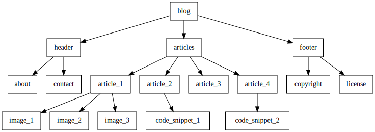

## Overview

<p align="center">
  
</p>

Transclude is a command-line program written in Rust that allows for the
inclusion of files within other files.

When a specially formatted include directive is encountered in a file, the
contents of the specified file are substituted in-place. This process is
recursive, enabling files to include other files which in turn include other
files.

This utility can be useful in a variety of scenarios where content needs to be
shared between multiple documents without duplicating the text including static
site generators, writing modular prose, and documentation.

## Features

- Recursive transclusion of input files
- Configurable start and end patterns for transclusion directives
- Optional Graphviz output
- Configurable Grahviz styling
- Cycle detection
- Colored output

## Setup

Ensure that you have the Rust toolchain installed. Clone this directory,
navigate to it, and build using cargo:

```sh
$ git clone https://github.com/username/repo.git
$ cd repo
$ cargo build --release
```

## Usage

After building the program, you can run it with the following command:

```sh
$ ./target/release/transclude [FLAGS] [OPTIONS] --input <filename>
```

### Arguments

```
Transclude files

Usage: transclusion [OPTIONS] [input]

Arguments:
  [input]

Options:
  -s, --start <VALUE>     The start pattern. Default: 'include{'
  -e, --end <VALUE>       The end pattern. Default: '}'
  -d, --dot <FILE>        Write a graphviz dot file
  -D, --dotstyle <STYLE>  The style for the dot file. Default: 'rankdir=LR;node [shape=box];'
  -h, --help              Print help
  -V, --version           Print version
```

### Include Directives

Include directives must follow the format specified by `--start` and `--end`
options (by default 'include{' and '}' respectively). For instance:

```
include{file_to_include.txt}
```

### Error Handling

Errors in file operations are handled by the program and it will terminate with
an error message detailing the nature of the problem (like file not found or
could not read file). It will also terminate if it detects cyclic inclusions,
preventing infinite loops.

### Styling

The user can specify the styling that will be written to the Graphviz file with
the `--dotstyle` flag. E.g.:

```sh
transclude -d out.dot --dotstyle "node[color=red]" data/foo && \
    dot out.dot -Tpng > out.png
```

## Example

Given two files `file1.txt` and `file2.txt`, you can include the contents of
`file2.txt` into `file1.txt` with the following directive:

In `file1.txt`:

```
This is file 1.
include{file2.txt}
End of file 1.
```

In `file2.txt`:

```
This is file 2.
```

After running the command `./target/release/transclude --input file1.txt`, the
output will be:

```
This is file 1.
This is file 2.
End of file 1.
```

## License

This work is licensed under the GNU General Public License version 3 (GPLv3).

[](https://www.gnu.org/licenses/gpl-3.0.en.html)
